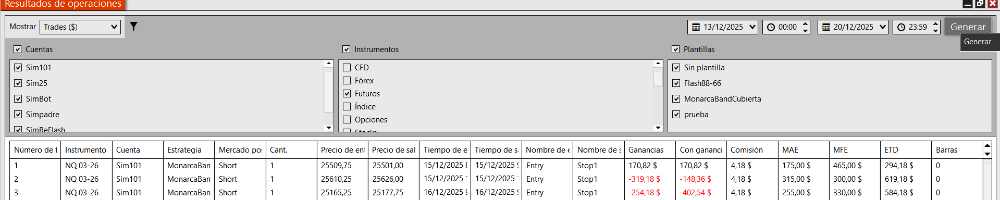
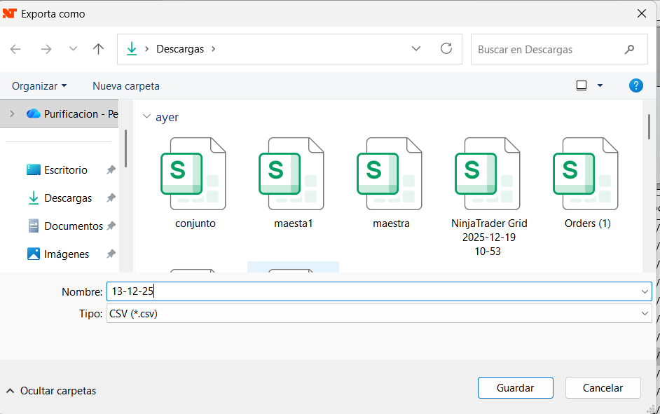

# Trading Control


## Descripción

**Trading Control** es una aplicación web progresiva (PWA) diseñada para el control y seguimiento profesional de operaciones de trading. Funciona completamente en el navegador utilizando almacenamiento local, lo que garantiza privacidad total de los datos y acceso offline.

## 🚀 Características Principales

### 📊 Dashboard Completo
- **Seguimiento de Balance**: Monitoreo en tiempo real del saldo inicial, actual y rendimiento (ROI)
- **Control de Drawdown**: Sistema de trailing drawdown con visualización del High Water Mark y suelo de pérdidas
- **Regla de Consistencia**: Prevención de concentración de riesgo mediante límite porcentual del día más rentable
- **Objetivos Configurables**: Seguimiento de metas semanales y mensuales con indicadores de progreso

### 📝 Registro de Operaciones
- **Datos Completos**: Registro de fecha, hora, tipo de operación, activo, estrategia y contratos
- **Clasificación Detallada**: Tipos de entrada y salida personalizables
- **Análisis Psicológico**: Registro de estado de ánimo, valoración de noticias y notas
- **Adjuntos Multimedia**: Captura de imágenes de las operaciones (comprimidas automáticamente)

### 📥 Importador Inteligente de NinjaTrader
- **Compatibilidad CSV**: Lectura directa del export "Account Performance" de NinjaTrader
- **Prevención de Duplicados**: Sistema de identificación único por número de trade
- **Multi-Cuenta**: Creación automática de cuentas desde los datos importados
- **Agrupación Inteligente**: Consolidación de múltiples líneas CSV en operaciones únicas

### 📈 Análisis y Estadísticas
- **Métricas Clave**: Win rate, profit factor, ganancia/pérdida media, duración promedio
- **Análisis Temporal**: Rendimiento por día de la semana y porcentaje de aciertos
- **Gráficos Interactivos**: Visualización del crecimiento de capital con Chart.js
- **Historial Filtrable**: Búsqueda por año, mes, tipo y resultado

### 🎯 Gestión de Objetivos
- **Metas Personales**: Sistema de registro y seguimiento de objetivos
- **Progreso Visual**: Indicadores de cumplimiento semanal y mensual
- **Historial de Logros**: Registro de metas conseguidas

### 🏆 Retos Semanales
- **Planificación**: Definición de retos semanales personalizados
- **Seguimiento Diario**: Control de cumplimiento y resultados operativos
- **Estadísticas Avanzadas**: Análisis de efectividad y cumplimiento
- **Historial Completo**: Registro histórico de semanas completadas

### ✅ Checklist Diario
- **Lista Personalizable**: Creación y edición de tareas diarias
- **Reset Automático**: Reinicio diario del checklist
- **Seguimiento Visual**: Indicadores de tareas completadas

### 🎨 Interfaz Moderna
- **Modo Claro/Oscuro**: Tema adaptable según preferencia
- **Diseño Responsive**: Optimizado para móviles, tablets y escritorio
- **PWA**: Instalable como aplicación nativa en cualquier dispositivo

## 🛠️ Tecnologías

- **Frontend**: HTML5, CSS3, JavaScript (Vanilla)
- **Gráficos**: Chart.js
- **Almacenamiento**: LocalStorage API
- **PWA**: Service Worker, Web App Manifest
- **Parseo CSV**: PapaParse

## 📦 Instalación y Uso

### Opción 1: Uso Directo en Navegador

1. Clona o descarga este repositorio
2. Abre el archivo `index.html` en tu navegador web
3. La aplicación funcionará completamente sin necesidad de servidor

### Opción 2: Servidor Local (Desarrollo)

```bash
# Ejecutar servidor Python
python server.py
```

La aplicación estará disponible en `http://localhost:5000`

### Opción 3: Instalación como PWA

1. Abre la aplicación en tu navegador
2. Busca la opción "Instalar" o "Añadir a pantalla de inicio"
3. La aplicación se instalará como una app nativa

## 📥 Guía de Importación desde NinjaTrader

### Paso 1: Exportar desde NinjaTrader

1. En NinjaTrader, ve a **Tools** → **Account Performance**
2. Selecciona la cuenta y el rango de fechas deseado
3. Haz clic en **Export** (esquina inferior derecha)
4. Guarda el archivo CSV en tu computadora

**Capturas de referencia:**






### Paso 2: Importar en Trading Control

1. Abre Trading Control
2. Selecciona o crea una cuenta
3. Haz clic en el botón **"Importar CSV"**
4. Selecciona el archivo exportado desde NinjaTrader
5. Espera a que se complete la importación

### Características del Importador

- **Detección Automática de Cuentas**: Crea cuentas automáticamente según el nombre en el CSV
- **Agrupación Inteligente**: Consolida múltiples líneas del mismo trade en una sola operación
- **Prevención de Duplicados**: Verifica el número de trade para evitar importaciones duplicadas
- **Configuración Inicial**: Establece valores predeterminados para cuentas nuevas (50,000€ inicial, 40% consistencia, 2,500€ drawdown)

## 📂 Estructura del Proyecto

```
trading-control/
├── index.html          # Aplicación principal (HTML)
├── assets/
│   ├── app.js         # Lógica de la aplicación
│   └── style.css      # Estilos y temas
├── manifest.json      # Configuración PWA
├── sw.js             # Service Worker (offline)
├── server.py         # Servidor de desarrollo
├── icon.png          # Icono de la aplicación
├── logo.jpg          # Logo principal
└── Fotos/            # Guía de importación NinjaTrader
    ├── info1.png
    ├── info2.png
    ├── info3.png
    ├── info4.png
    └── info5.png
```

## 🔒 Privacidad y Seguridad

- **100% Local**: Todos los datos se almacenan en tu navegador
- **Sin Servidor**: No se envía información a servidores externos
- **Sin Rastreo**: No hay cookies de terceros ni analytics
- **Backup Manual**: Exporta tus datos cuando lo necesites

## 🎯 Arquitectura Local-First

La aplicación utiliza una arquitectura **Local-First** que garantiza:

- ✅ Funcionamiento offline completo
- ✅ Sincronización instantánea (sin latencia de red)
- ✅ Control total de tus datos
- ✅ Sin dependencias de servicios externos
- ✅ Privacidad absoluta

## 🔧 Configuración de Cuenta

Cada cuenta puede configurar individualmente:

- **Saldo Inicial**: Capital de partida
- **Drawdown Trailing/EOD**: Límite de pérdida permitido
- **Porcentaje de Consistencia**: Límite del día más rentable sobre ganancias totales

## 📊 Métricas Calculadas

- **ROI**: Retorno sobre inversión
- **Win Rate**: Porcentaje de operaciones ganadoras
- **Profit Factor**: Ratio entre ganancias y pérdidas
- **Duración Media**: Tiempo promedio de operación
- **Efectividad por Día**: Rendimiento según día de la semana
- **Cumplimiento de Objetivos**: Progreso hacia metas semanales/mensuales

## 🌐 Compatibilidad

- **Navegadores**: Chrome, Firefox, Safari, Edge (últimas versiones)
- **Dispositivos**: Escritorio, Tablet, Móvil
- **Sistemas Operativos**: Windows, macOS, Linux, iOS, Android

## 📱 PWA (Progressive Web App)

La aplicación puede instalarse como una app nativa en:

- **Android**: Añadir a pantalla de inicio desde Chrome
- **iOS**: Añadir a pantalla de inicio desde Safari
- **Windows/macOS**: Instalar desde Chrome/Edge

## 🚀 Despliegue

### Despliegue Estático en Replit

1. Abre el proyecto en Replit
2. Ve a la pestaña **Deployments**
3. Selecciona **Static Deployment**
4. Configura:
   - **Public Directory**: `./`
   - **Build Command**: (dejar vacío)
5. Haz clic en **Deploy**

La aplicación estará disponible en una URL pública de Replit.

## 📝 Licencia

Este proyecto es de código abierto. Puedes usarlo, modificarlo y distribuirlo libremente.

## 🤝 Contribuciones

Las contribuciones son bienvenidas. Si encuentras algún bug o tienes sugerencias de mejora, por favor:

1. Reporta el issue
2. Propón una mejora
3. Envía un pull request

## 📧 Soporte

Para dudas o problemas técnicos, abre un issue en el repositorio del proyecto.

---

**Trading Control** - Tu diario de trading profesional, privado y offline.

© 2025 - Desarrollado con ❤️ para traders
